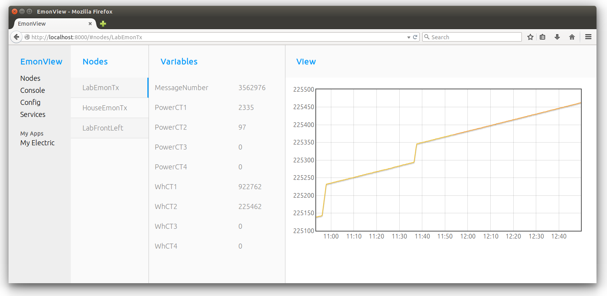

# EmonView
An open source python, flask, socketio, js web application for monitoring and control

# Todo

- name? is there a better name than emonview
- show/hide graph
- zoom/pan graph
- graph statistics
- load config info such as units
- create node list from config first then populate with mqtt values
- wh elapsed processor
- full http rest api
- record button
- last updated value
- emonhub integration
- service based dispatchers listening on mqtt?
- complete concept apps:
    - my electric
    - heating controller
- mobile/tablet/responsive views
- services page

# Install

    git clone https://github.com/emoncms/emonview.git

additional packages to install on top of standard raspberrypi sd card install:

    sudo pip install Flask
    sudo pip install Flask-SocketIO
    sudo pip install mosquitto
    sudo pip install redis
    
ensure redis-server is running:

    sudo service redis-server status
    sudo service redis-server start
    
Installation of Flask-SocketIO can be slow on a raspberrypi.

see: https://flask-socketio.readthedocs.org/en/latest/

Code is based on the flask-socketio example

# Run 

    python emonview/app/app.py
    python emonview/rfmpi2mqtt.py

if installing on ready to go SD card image ufw firewall is installed blocking on port 8000, you can enable port 8000 with:

    sudo ufw allow 8000/tcp
    
navigate to the pi's ip address and add the port number to the end, i.e:

    192.168.1.65:8000
    
this should present you with a login

## Run using services:

Install rfmpi2mqtt service: 

    sudo cp /home/pi/emonview/rfmpi2mqtt/rfmpi2mqtt /etc/init.d/
    sudo chmod 755 /etc/init.d/rfmpi2mqtt
    sudo update-rc.d rfmpi2mqtt defaults
    sudo chmod 755 /home/pi/emonview/rfmpi2mqtt/rfmpi2mqtt.py
    
Install emonview service: 

    sudo cp /home/pi/emonview/app/emonview /etc/init.d/
    sudo chmod 755 /etc/init.d/emonview
    sudo update-rc.d emonview defaults
    sudo chmod 755 /home/pi/emonview/app/app.py
    

# Login

Username: demo, password: demo
