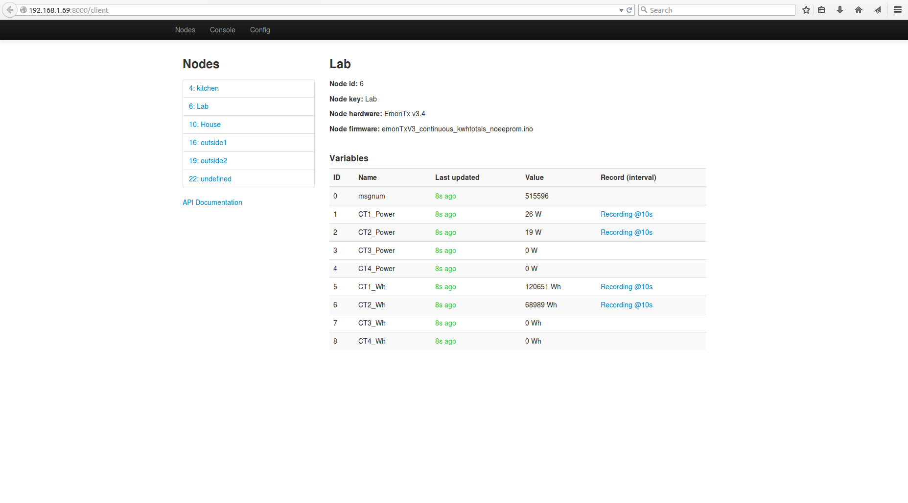
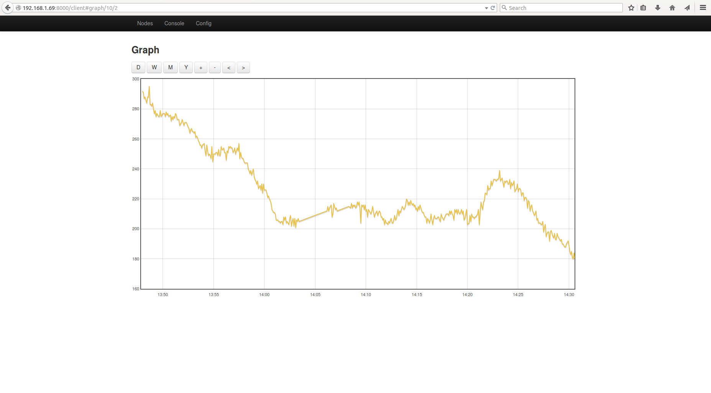
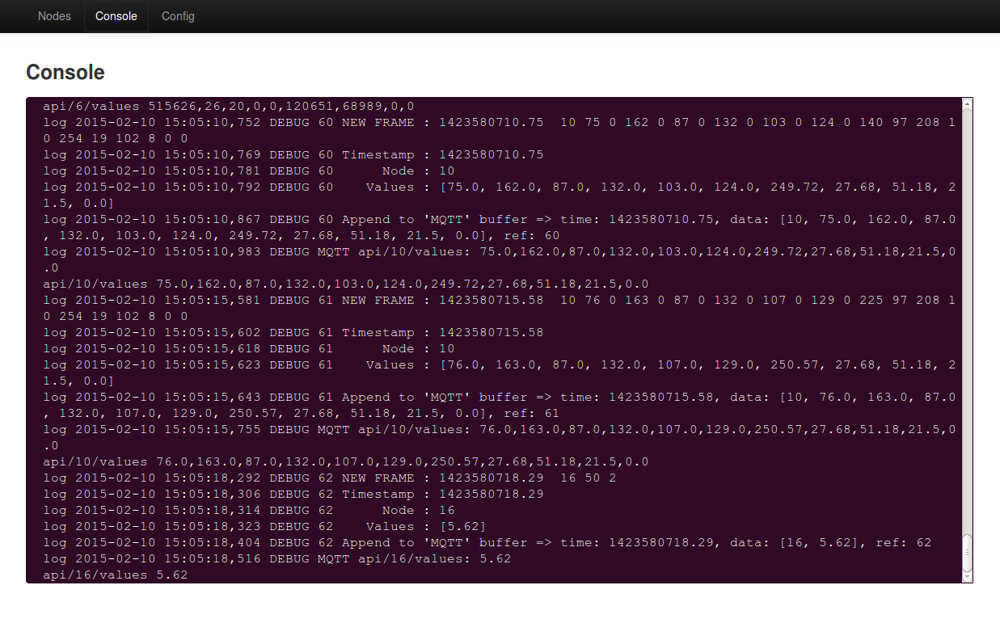
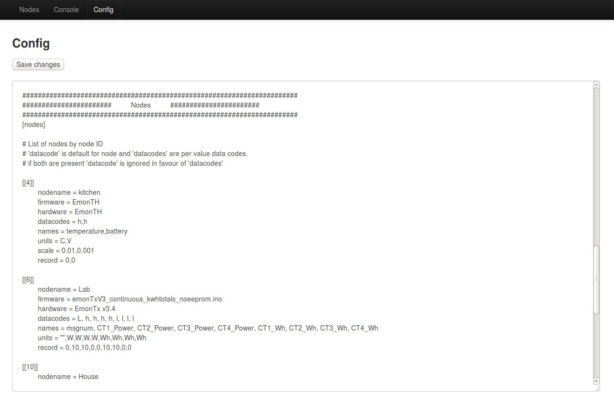

# EmonView

The nodes interface shows all the nodes received by the rfmpi and listed in emonhub.conf:

If a node:variable is being recorded it can be viewed on a graph:

The console window shows the output of emonhub.log in the browser using sockets for live scrolling.

Config is an in-browser emonhub.conf editor:

## API

### GET /api
	
/api

    {
        "10":{
            "nodename":"House",
            "firmware":"emontx_firmware_continuous",
            "hardware":"EmonTx v3.4",
            "time":1423344776,
            "names":["power1","power2","power3"],
            "values":["100","200","300"],
            "units":["W","W","W"]
        }
    }

### GET nodes/nodeid

/api/10

    {
        "nodename":"House",
        "firmware":"emontx_firmware_continuous",
        "hardware":"EmonTx v3.4",
        "time":1423344776,
        "names":["power1","power2","power3"],
        "values":["100","200","300"],
        "units":["W","W","W"]
    }

/api/10/nodename

    "House"

/api/10/hardware

    "EmonTx v3.4"

/api/10/firmware

"emontx_firmware_continuous"

/api/10/names

    ["power1","power2","power3"]

/api/10/values

    [100,200,300]

/api/10/units

    ["W","W","W"]

### GET nodes/nodeid/varid

/api/10/0

    {"name":"power1","value":"100","unit":"W"}

/api/10/0/name

    "power1"

/api/10/0/value

    100

/api/10/0/unit

    "W"

/api/10/0/meta

    {"start":null,"interval":null,"npoints":0,"size":false}

/api/10/0/data?start=0&end=0&interval=60

    timeseries data

## Install

Installation guide for the raspberrypi:

### Raspbian

Download the official raspberrpi raspbian image and write to the SD card.

    [http://www.raspberrypi.org/downloads](http://www.raspberrypi.org/downloads)
    
To upload the image using dd on linux 

Check the mount location of the SD card using:

    df -h
    
Unmount any mounted SD card partitions
    
    umount /dev/sdb1
    umount /dev/sdb2
    
Write the raspbian image to the SD card (Make sure of=/dev/sdb is the correct location)

    sudo dd bs=4M if=2014-06-20-wheezy-raspbian.img of=/dev/sdb

Insert the SD card into the raspberrypi and power the pi up.

Find the IP address of your raspberrypi on your network then connect and login to your pi with SSH, for windows users there's a nice tool called [putty](http://www.putty.org/) which you can use to do this. To connect via ssh on linux, type the following in terminal:

    ssh pi@YOUR_PI_IP_ADDRESS

It will then prompt you for a username and password which are: **username:**pi, **password:**raspberry.

### Setup Data partition

Steps for creating 3rd partition for data using fdisk and mkfs:

    sudo fdisk -l
    Note end of last partition (5785599 on standard sd card)
    sudo fdisk /dev/mmcblk0
    enter: n->p->3
    enter: 5785600
    enter: default or 7626751
    enter: w (write partition to disk)
    fails with error, will write at reboot
    sudo reboot
    
    On reboot, login and run:
    sudo mkfs.ext2 -b 1024 /dev/mmcblk0p3
    
**Note:** *We create here an ext2 filesystem with a blocksize of 1024 bytes instead of the default 4096 bytes. A lower block size results in significant write load reduction when using an application like emoncms that only makes small but frequent and across many files updates to disk. Ext2 is choosen because it supports multiple linux user ownership options which are needed for the mysql data folder. Ext2 is non-journaling which reduces the write load a little although it may make data recovery harder vs Ext4, The data disk size is small however and the downtime from running fsck is perhaps less critical.*
    
Now that your loged in to your pi, the first step is to edit the _inittab_ and _boot cmdline config_ file to allow the python gateway which we will install next to use the serial port, type:

    sudo nano /etc/inittab

At the bottom of the file comment out the line, by adding a ‘#’ at beginning:

    # T0:23:respawn:/sbin/getty -L ttyAMA0 115200 vt100

[Ctrl+X] then [y] then [Enter] to save and exit

Edit boot cmdline.txt

    sudo nano /boot/cmdline.txt

replace the line:

    dwc_otg.lpm_enable=0 console=ttyAMA0,115200 kgdboc=ttyAMA0,115200 console=tty1 
    root=/dev/mmcblk0p2 rootfstype=ext4 elevator=deadline rootwait

with:

    dwc_otg.lpm_enable=0 console=tty1 root=/dev/mmcblk0p2 rootfstype=ext4 elevator=deadline rootwait
    
Create a directory that will be a mount point for the rw data partition

    mkdir /home/pi/data
    
### Read only mode

Configure Raspbian to run in read-only mode for increased stability (optional but recommended)

The following is copied from: 
http://emonhub.org/documentation/install/raspberrypi/sd-card/

Then run these commands to make changes to filesystem

    sudo cp /etc/default/rcS /etc/default/rcS.orig
    sudo sh -c "echo 'RAMTMP=yes' >> /etc/default/rcS"
    sudo mv /etc/fstab /etc/fstab.orig
    sudo sh -c "echo 'tmpfs           /tmp            tmpfs   nodev,nosuid,size=30M,mode=1777       0    0' >> /etc/fstab"
    sudo sh -c "echo 'tmpfs           /var/log        tmpfs   nodev,nosuid,size=30M,mode=1777       0    0' >> /etc/fstab"
    sudo sh -c "echo 'proc            /proc           proc    defaults                              0    0' >> /etc/fstab"
    sudo sh -c "echo '/dev/mmcblk0p1  /boot           vfat    defaults                              0    2' >> /etc/fstab"
    sudo sh -c "echo '/dev/mmcblk0p2  /               ext4    defaults,ro,noatime,errors=remount-ro 0    1' >> /etc/fstab"
    sudo sh -c "echo '/dev/mmcblk0p3  /home/pi/data   ext2    defaults,rw,noatime                   0    2' >> /etc/fstab"
    sudo sh -c "echo ' ' >> /etc/fstab"
    sudo mv /etc/mtab /etc/mtab.orig
    sudo ln -s /proc/self/mounts /etc/mtab
    
The Pi will now run in Read-Only mode from the next restart.

Before restarting create two shortcut commands to switch between read-only and write access modes.

Firstly “ rpi-rw “ will be the command to unlock the filesystem for editing, run

    sudo nano /usr/bin/rpi-rw

and add the following to the blank file that opens

    #!/bin/sh
    sudo mount -o remount,rw /dev/mmcblk0p2  /
    echo "Filesystem is unlocked - Write access"
    echo "type ' rpi-ro ' to lock"

save and exit using ctrl-x -> y -> enter and then to make this executable run

    sudo chmod +x  /usr/bin/rpi-rw

Next “ rpi-ro “ will be the command to lock the filesytem down again, run

    sudo nano /usr/bin/rpi-ro

and add the following to the blank file that opens

    #!/bin/sh
    sudo mount -o remount,ro /dev/mmcblk0p2  /
    echo "Filesystem is locked - Read Only access"
    echo "type ' rpi-rw ' to unlock"

save and exit using ctrl-x -> y -> enter and then to make this executable run

    sudo chmod +x  /usr/bin/rpi-ro
        
Lastly reboot for changes to take effect

    sudo shutdown -r now
    
Login again, change data partition permissions:

    sudo chmod -R a+w data
    sudo chown -R pi data
    sudo chgrp -R pi data

### Install dependencies

Update the rasbian repositories with:

    rpi-rw

    sudo apt-get update

Install all dependencies:

    sudo apt-get install git-core redis-server build-essential ufw ntp python-serial python-configobj mosquitto mosquitto-clients python-pip python-dev python-rpi.gpio screen sysstat minicom

Optional for firmware upload support:

    sudo pip install ino
    sudo apt-get install arduino
    
Python items:
    
    sudo pip install mosquitto
    sudo pip install redis
    sudo pip install Flask
    
**Redis**

Configure redis to run without logging or data persistance.

    sudo nano /etc/redis/redis.conf

comment out redis log file

    # logfile /var/log/redis/redis-server.log

comment out all redis saving

    # save 900 1
    # save 300 10
    # save 60 10000
    
    sudo /etc/init.d/redis-server start
    
### Security

[http://blog.al4.co.nz/2011/05/setting-up-a-secure-ubuntu-lamp-server/](http://blog.al4.co.nz/2011/05/setting-up-a-secure-ubuntu-lamp-server/)

**Install ufw**

ufw: uncomplicated firewall, is a great little firewall program that you can use to control your server access rules. The default set below are fairly standard for a web server but are quite permissive. You may want to only allow connection on a certain ip if you will always be accessing your pi from a fixed ip.

UFW Documentation
[https://help.ubuntu.com/community/UFW](https://help.ubuntu.com/community/UFW)

    sudo ufw allow 80/tcp
    sudo ufw allow 443/tcp
    sudo ufw allow 22/tcp
    sudo ufw enable

**Change root password**

Set root password

    sudo passwd root

The default root password used in the ready to go image is **raspberry**. 
Change this to a hard to guess password to make your root account secure.

**Secure MySQL**

Run mysql_secure_installation see [mysql docs](http://dev.mysql.com/doc/refman/5.0/en/mysql-secure-installation.html)

    mysql_secure_installation

**Secure SSH**

Disable root login:

    sudo nano /etc/ssh/sshd_config

Set **PermitRootLogin** to **no**

### Reboot the pi

    sudo reboot
    
